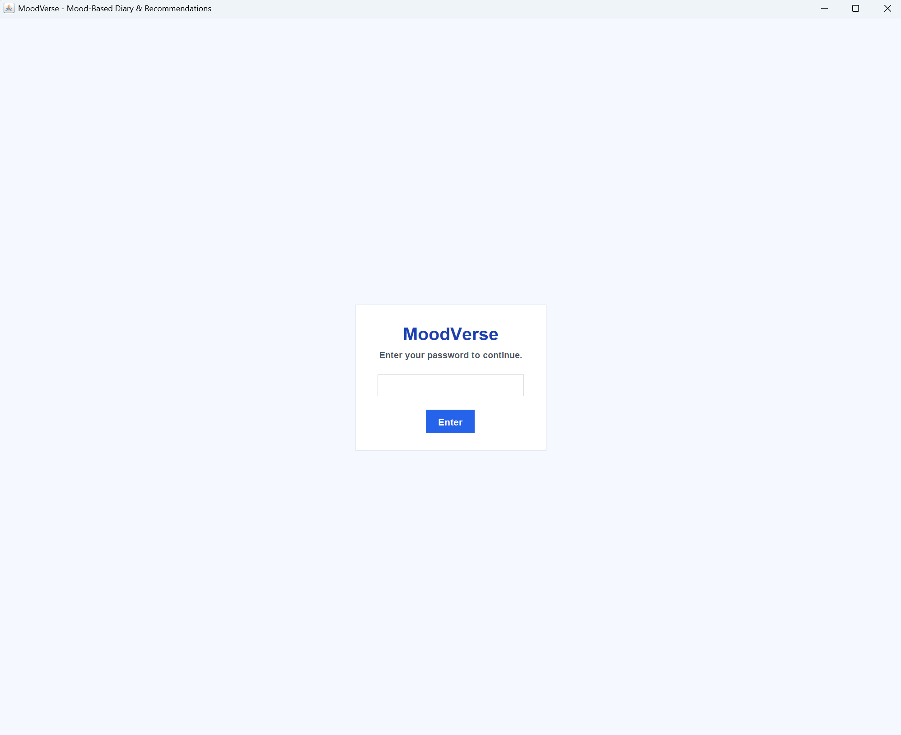
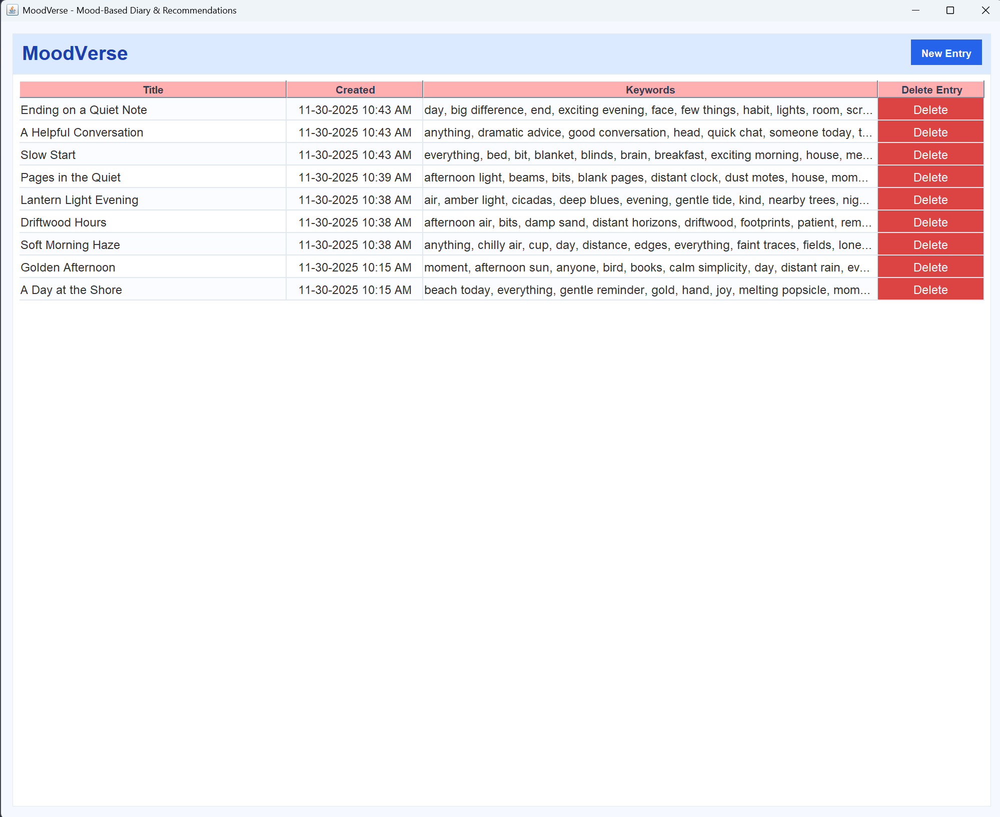
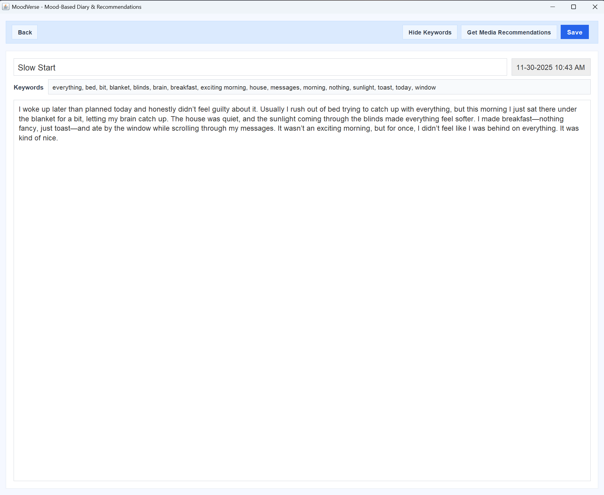
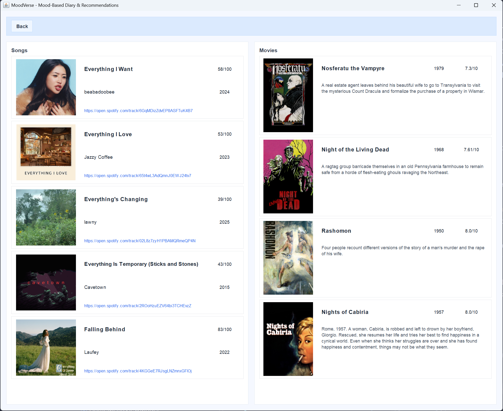

# MoodVerse

MoodVerse is a desktop diary app that lets users create, save, edit, and organize personal entries. It uses natural language processing (NLP) to analyze each entry’s sentiment, identify the user’s emotional state, and recommend songs and movies that reflect the overall tone and themes of the writing.

## Table of Contents

1. [Overview](#overview)
2. [Features](#features)
3. [How It Works (with Screenshots)](#how-it-works-with-screenshots)
4. [Getting Started](#getting-started)
5. [Technologies & APIs](#technologies--apis)
6. [Future Features](#future-features-not-in-mvp)

## Features

- **Create Diary Entries** – Write and store personal diary entries.
- **Manage Entries** – Manually save your writing to a chosen folder and delete entries you no longer want, keeping your diary organized and relevant.
- **Load Entries** – Reopen past entries to read or edit them.
- **Password Protection** – Lock the diary with a password so entries remain private and secure.
- **Analyze Writing** – Use NLP to extract keywords and phrases from your writing and summarize the main ideas and topics.
- **Get Recommendations** – Receive music (Spotify) and movie (TMDb) suggestions that reflect the overall themes and tone of your writing.

## How It Works (with Screenshots)

1. **Password-Protected Access**  
   On startup, the app presents a lock screen. Users must enter the correct password before accessing any diary entries.
   

2. **Home / Entry List View**  
   After unlocking, users land on the home screen, where they can browse existing diary entries and choose to create a new one.
   

3. **Write an Entry**  
   From the home screen, users can create a new diary entry and type their thoughts.
   

4. **Save & Organize**  
   When finished, users manually save the entry to their chosen location. Saved entries can later be loaded, edited, or deleted from the home screen.

5. **NLP Analysis & Recommendations**  
   When users request recommendations, the app uses Stanford CoreNLP to identify keywords, phrases, and overall themes in the entry. These are then sent to Spotify and TMDb to fetch songs and movies that match the themes and vibe of the writing.
   

## Getting Started

### Prerequisites

- Java 11 or higher
- Maven
- Access tokens / API keys for:
  - Spotify Web API
  - TMDb API
- `.env` file configured for API keys (via `dotenv-java`).

### `.env` Configuration

Create a `.env` file in the project root with the following structure:

```dotenv
SPOTIFY_CLIENT_ID={your-spotify-client-id}
SPOTIFY_CLIENT_SECRET={your-spotify-client-secret}
TMDB_API_KEY={your-tmdb-api-key}
PASSWORD=
```

- All API credentials can be obtained for free by following the official documentation links for Spotify and TMDb listed below.
- Leave `PASSWORD` blank when first creating a new password. The application will then set and store the password the first time you configure it.
- To change the password later, you can update this field.

## Technologies & APIs

- **Language:** Java
- **Build Tool:** Maven
- **NLP:** [Stanford CoreNLP](https://stanfordnlp.github.io/CoreNLP/)
- **Music Recommendations:** [Spotify Web API](https://developer.spotify.com/documentation/web-api)
- **Movie Recommendations:** [TMDb API](https://developer.themoviedb.org/docs)
- **Configuration:** [`dotenv-java`](https://github.com/cdimascio/dotenv-java) for environment variables

## Future Features (Not in MVP)

- User accounts (sign up, login, logout)
- Public diary sharing
- Browsing diaries shared by others

---
